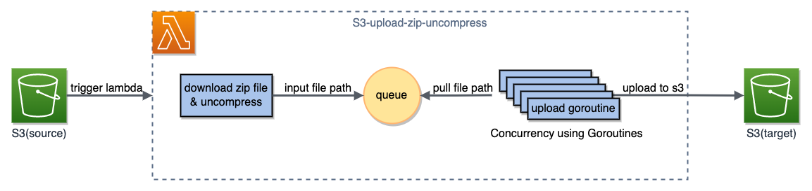
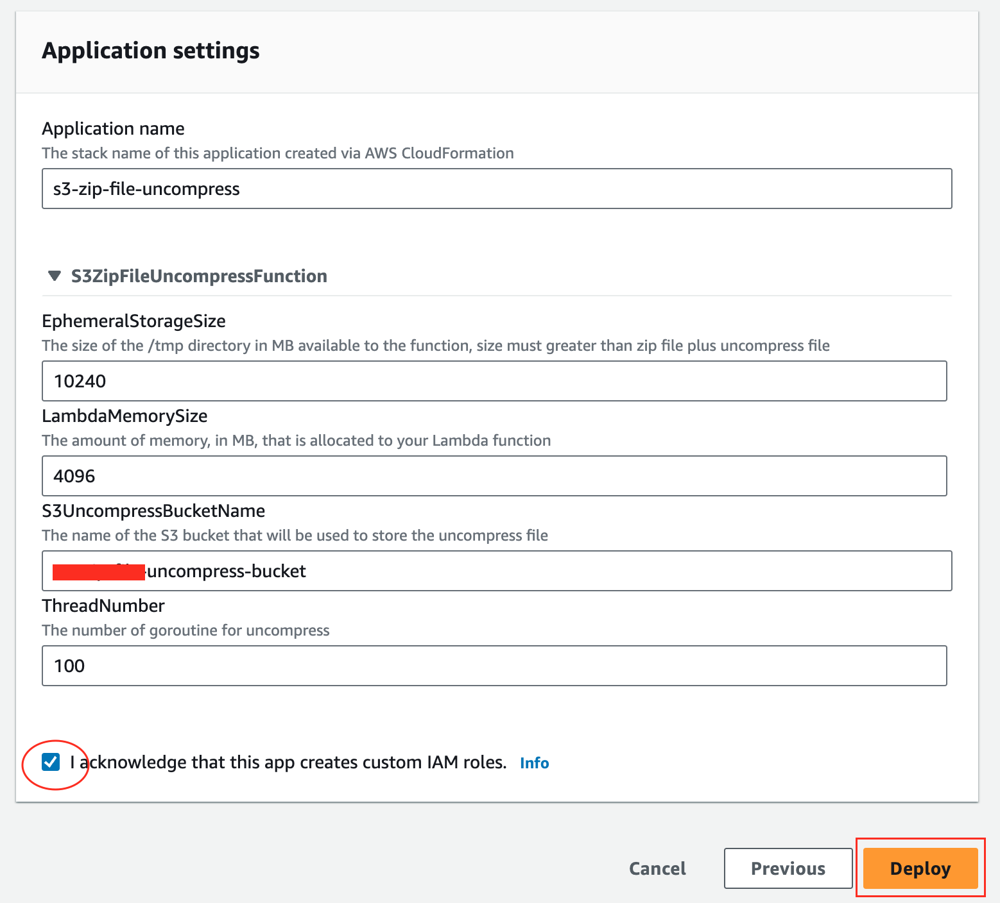
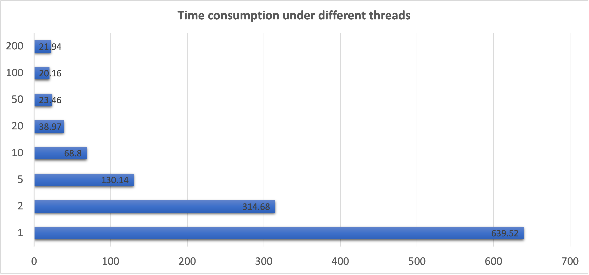
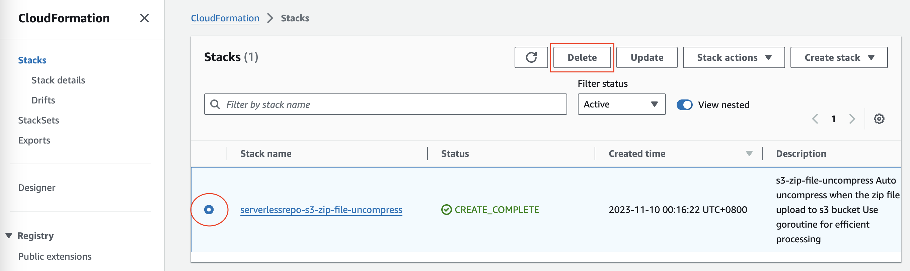

# s3-zip-file-uncompress

Auto uncompress when the zip file upload to s3 bucket, Use goroutine for efficient processing.

## Overview

After S3 receives the uploaded zip file, S3 triggers Lambda to download and unzip it. Once unzipped, the files are uploaded to the target S3 bucket in a multi-threaded fashion.

## Deployment Guide

Click the link [s3-zip-file-uncompress](https://console.aws.amazon.com/lambda/home#/create/app?applicationId=arn:aws:serverlessrepo:us-west-2:699461715380:applications/s3-zip-file-uncompress) to open the application page in the AWS Serverless Application Repository. Enter the name of the S3 bucket to store the uncompressed files, check the box to confirm that the application will create the corresponding resource policies, and click the Deploy button to install.

**Note:** You can change the corresponding temporary storage size, but you need to ensure that the space occupied by all files before and after decompression is less than the storage size. You can adjust the memory size of Lambda and the number of parallel uploads and threads according to business needs. 

After installation is complete, you can select the corresponding stack on the CloudFormation console page, and select Resources to view the created Lambda function name.

Click the Lambda function link to go to the function details page. Add a trigger by clicking **Add trigger**.

On the Trigger configuration page, select S3 as the trigger source and choose the corresponding bucket used to upload the zip files. In the Event types section, select **All object create events** and only suffix **.zip** files will trigger it. Tick the note and click the **Add** button to add it.

After completing the trigger configuration, uploading a zip file to the S3 bucket will automatically trigger Lambda to unzip the file and upload them to the specified S3.

(Optional) Add active notifications for Lambda execution results. On the Lambda function page, click **Add destination** to enable message pushes for success or failure.

## Test

This test compares the time it takes to upload a 500MB zip file containing 13,000 small files using Lambda with 3GB of memory allocated under different thread count settings.

With higher thread count settings, the time consumed by Lambda is shorter. At the same time, due to the limit on file descriptors in Lambda, increasing the thread count beyond 100 does not provide additional benefits.

## Cleaning up

To avoid unnecessary charges, in the CloudFormation Stacks, select the corresponding stack and click Delete.

